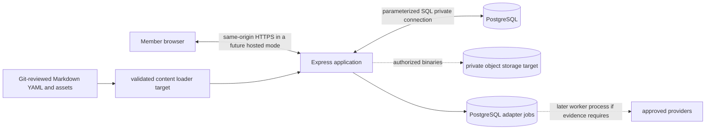

# CTP-001: architecture audit and reuse decision

- **Issue:** [CTP-001 #15](https://github.com/deepnative/deep-native-engine/issues/15)
- **Owner:** Tom Wu
- **Audit date:** 22 September 2026
- **Claim:** `ctp001-architecture-audit-20260922`
- **Audited base:** `66b6aa052266ad33020f10ad90e9f74e92b85c71`
- **Decision:** Keep the current TypeScript/Express/PostgreSQL modular monolith and reconcile it with [ADR-0002](decisions/ADR-0002-file-first-hosted-modular-monolith.md). Reuse the tested local foundations. Build the remaining catalog, participation, offer and production boundaries only in their authorized issues.

## Scope and provenance

CTP-001 originally began when this repository contained the preserved planning package and repository tooling. Authorized issues subsequently added a local synthetic application. This audit records both facts: the architecture was selected from the planning-only starting point, and the audited checkout now contains a working local learning slice plus deterministic adapters, workspace authorization and private evidence foundations. It does not resurrect code from the archived source or claim that the current local preview is hosted or production-ready.

The audit covers reusable authentication and authorization boundaries, UI/design, commercial and billing assumptions, tests and operations, owned content, application placement, module ownership, relational schema, migrations, storage, jobs and the cross-audience domain model. It changes documentation only. CTP-007 remains responsible for moving authored curriculum into versioned files; no application behavior, dependency, provider, deployment or commercial state changes here.

Current precedence is: explicit owner instructions, [product direction](PRODUCT-DIRECTION.md), revised live issues, accepted decisions and applicable historical specifications. The 25 CTP identifiers remain traceability keys. Contractor-only positioning and mandatory career or commercial assumptions are superseded.

## Repository inventory and reuse decisions

| Concern | Confirmed current state | Decision | Follow-up boundary |
| --- | --- | --- | --- |
| Authentication | A random browser credential is stored in an HttpOnly, SameSite=Strict cookie; only its SHA-256 hash is persisted. PostgreSQL resolves the principal on each private request. It is loopback-only synthetic identity with no verification, recovery or cross-device login. | Reuse the credential-to-principal interface, safe cookie defaults and server-derived identity pattern in local/test work. Do not describe it as production authentication. | A separately authorized production identity issue must select verification, recovery, staff bootstrap/rotation, session revocation and stable secret handling before real users. |
| Authorization | `src/authorization.ts` and migration 003 enforce member ownership, typed and expiring coach/reviewer assignments, exact-purpose audited support access, revocation and bounded cohort reads. Background and goal never grant privilege. | Reuse these policy primitives and database constraints. Extend them by explicit capability and resource; do not infer privilege from profile fields, offers or participation. | Contribution moderation, publication, qualified-review operations and production database roles remain separate work. |
| UI and design | Express renders accessible HTML/forms; plain CSS supports desktop and narrow mobile layouts. Output escaping, CSP, Host/Origin checks, CSRF and no-store responses are tested. No client framework is required by current journeys. | Reuse the server-rendered same-origin shell and design tokens for the next bounded slices. Add browser JavaScript only for an evidenced interaction need. | Brand research, a richer design system and all-browser/accessibility acceptance remain owned roadmap outcomes. |
| Commercial and billing | There is no charge, entitlement, ledger, subscription or payment-provider implementation. The payment adapter reports deterministic readiness only. Historical CAD prices are optional coaching hypotheses, not membership prices. | Reuse the adapter/job boundary and historical standalone-pilot, anniversary, explicit-purchase, cancellation and ledger invariants if a paid offer is later authorized. Keep foundation access independent from the legacy offer named Professional. | CTP-002 and later commercial issues must decide the access model, offers, entitlements, tax/refund rules and payment provider. No revenue or demand claim is established here. |
| Tests and operations | The shared gate checks formatting, lint, types, per-file and global 99% unit metrics, real PostgreSQL integration, desktop/mobile Chromium journeys, build, dependency audit and negative probes. CI repeats it on Ubuntu and macOS. | Reuse `make verify`, the exact-revision hook, isolated `dne_test_<32-hex>` databases, synthetic fixtures and versioned scenario register for every slice. | Each issue adds behavior-based evidence and keeps the full-release denominator visible. Deployment, restore and live-provider evidence require distinct gates. |
| Owned content | One lesson, three background labels, three goal labels and exercise examples currently live in `src/content.ts`. Public docs/assets are Git-reviewed. There is no validated file catalog, publication workflow or complete rights register. | Preserve current behavior, then move authored public curriculum into stable-ID/version Markdown and YAML through CTP-007. Keep private drafts, progress and evidence out of repository content. | Content schema/loader, rights metadata, review ownership, translations and immutable version resolution are greenfield CTP-007 work. |
| Application and persistence | One TypeScript/Express process owns routes and server-rendered views. PostgreSQL holds mutable/private/transactional state. Local evidence bytes use a private filesystem adapter outside public assets. | Keep a same-origin modular monolith and standard PostgreSQL. Place provider-specific configuration at the infrastructure edge. | Managed object storage, malware scanning, hosted configuration, controlled release migrations and backup/restore need separate authorization. |
| Participation and contribution | Cohorts provide exact, revocable read access to bounded shared content. Evidence destinations distinguish private review, possible future community publication and one learning circle. There is no general social feed or publication workflow. | Reuse the cohort and explicit-consent boundaries. Treat participation and contribution as separate opt-in domain capabilities. | PLAN-002, CTP-020, CTP-021 and QA-004 own rules, moderation, attribution, rights, reporting and publication. |

No existing application from another project is copied. Reuse means retaining reviewed patterns and code already in this repository; greenfield means a new, issue-authorized capability behind the existing boundaries.

## Application placement and module ownership

The product runtime remains one dynamic web application and one PostgreSQL database. GitHub Pages may host public documentation or marketing files, but it cannot run this application's Express behavior or database transactions. A separate static frontend and cross-origin API would add identity, CORS, deployment and observability boundaries without a current user need.

| Module boundary | Current ownership and rule |
| --- | --- |
| Runtime/configuration | `src/main.ts`, `src/runtime.ts` and `src/config.ts` construct dependencies and reject unsafe local/live crossover. Domain modules do not read arbitrary environment variables. |
| HTTP/application | `src/app.ts` owns routing, request limits, Host/Origin/CSRF checks and generic denials. It delegates persistence and policy decisions. |
| Identity/session | `src/session.ts` creates opaque credentials and CSRF values; PostgreSQL stores hashes and resolves principals. Browser-supplied resource or actor IDs never choose the principal. |
| Learning domain | `src/content.ts`, `src/validation.ts`, `src/store.ts` and `src/views.ts` own the current goal, lesson, exercise and progress slice. Authored content moves behind a typed loader without moving private progress into files. |
| Authorization | `src/authorization.ts` owns workspace, staff-grant and cohort access policy. It fails closed when the feature is unavailable. |
| Evidence | `src/evidence.ts` owns upload validation, consent, quarantine, capabilities and coordinated metadata/object deletion. Raw bytes do not enter routine logs or PostgreSQL fields. |
| Providers/jobs | `src/adapters.ts` exposes honest readiness and deterministic boundaries. `src/jobs.ts` owns idempotent durable work, leases, attempt bounds and safe errors. Live providers are not implemented. |
| Persistence/migrations | `src/store.ts`, authorization/job/evidence stores and ordered SQL migrations own transactions and constraints. The database is authoritative for dynamic private state. |
| Test evidence | Unit, integration and browser suites plus `scripts/repo.py` own reproducible acceptance evidence. A passing slice does not imply a deployed or commercially validated product. |

Split this monolith only when measured load, security isolation, independent deployment cadence or clear team ownership justifies the added operational boundary. A background worker may be the first separate process while continuing to use the PostgreSQL job contract.

## Relational schema and migration policy

| Migration | Reusable records and constraints | Boundary |
| --- | --- | --- |
| `001-learning.sql` | Learners, hashed unique credentials, constrained background/goal, expiry, versioned exercises and cascade deletion. | The one-choice background/goal columns are initial-slice inputs, not the final multi-interest taxonomy. Content IDs/versions must later resolve against the file catalog. |
| `002-adapter-jobs.sql` | Adapter/mode allowlists, unique idempotency key, request fingerprint, bounded attempts, leases, terminal states and safe error codes. | No payload, credential or raw provider error persistence; no live provider effect is implied. |
| `003-workspace-authorization.sql` | Principals, member-owned workspaces, typed staff roles, assignment/support grants, audit records, cohorts and exact memberships/content. Composite keys prevent cross-workspace exercise joins. | Profile attributes do not grant access. Production identity, retention and database-role policy remain open. |
| `004-private-evidence.sql` | Evidence ownership, consent destinations, hashes, quarantine, review submissions, derivatives and workspace deletion state. | PostgreSQL stores metadata only; source/derived bytes use private object storage and coordinated cleanup. |

Migrations are append-only, ordered and idempotent for fresh local/test databases. New migrations must use constraints for durable invariants, preserve stable content references, state their forward/rollback compatibility and be exercised against an isolated real PostgreSQL database. The current process applies migrations at local startup; hosted rollout must replace that with a single controlled release step. A rollback never automatically drops or rewrites populated member data. Backup existence is not recovery evidence until an isolated restore is exercised.

## Storage and asynchronous work

Use this classification consistently:

- Git-versioned Markdown/YAML/assets: public, human-authored, reviewed, release-versioned content with stable IDs, versions, owner and rights metadata.
- PostgreSQL: private, mutable, transactional, authorization, workflow, progress, consent, entitlement, ledger, audit and operational metadata.
- Private object storage: uploaded or generated binaries, referenced by opaque keys and PostgreSQL lifecycle metadata. The current filesystem adapter is local/test evidence only.
- PostgreSQL jobs: initial durable asynchronous boundary for AI, payment, storage, calendar, email, auth and analytics operations. Payloads and secrets stay outside generic job rows.
- Hosting secret/environment configuration: database URLs, provider credentials, signing keys and other secrets; never repository content or fixtures.

In the hosted target, the application filesystem is deployment input, not durable runtime state. The current local/test evidence adapter deliberately writes to a private ignored directory outside public assets. Database or provider failures return an honest unconfirmed/disabled state, never a fabricated save or external effect. Idempotency, bounded attempts, lease recovery, redacted errors and deletion reconciliation are retained when provider implementations are added.

## Cross-audience domain model

The following concepts remain separate even when the UI presents them together:

| Concept | Meaning | Authorization/commercial effect |
| --- | --- | --- |
| Member identity | A person with an authenticated principal and owned workspace. | Establishes the actor and resource ownership only. |
| Backgrounds, interests and goals | Changeable descriptors such as IT, another profession, general exploration, everyday use, work or building. A member may eventually select several. | Select content and recommendations; never create a staff role, qualification, entitlement or price. |
| Curated track/content | Stable, versioned lessons, exercises, rubrics, prerequisites and supported audience/goal metadata. | Visibility/eligibility follows published catalog rules; content files never grant private data access. |
| Participation | Opt-in membership in an exact learning circle, clinic or bounded discussion space, with leave/report/moderation rules. | Grants only the explicitly shared resource while membership is active. |
| Contribution | A member proposal for an example, workflow or resource with attribution, rights, review and publication lifecycle. | Private work stays private until explicit consent and a successful publication review. Participation alone never publishes content. |
| Optional offer | Career preparation, coaching, contracting support or another explicitly selected service. | Requires a distinct offer/entitlement decision. The legacy Professional offer is not the same as a professional background. |
| Staff authorization | Typed coach, reviewer, editor, moderator, operator or administrator capability with exact scope, purpose, expiry, revocation and audit as applicable. | Granted through trusted administration, never inferred from membership, background, contribution, payment or offer name. |

This model supports a general learner choosing a beginner foundation, a non-IT professional applying AI to domain work and an IT practitioner selecting a technical workflow without placing any of them into a commercial or privileged category. It also preserves optional coaching and contractor paths without making them universal admission criteria.

## Exact maintained tool set

The audited lockfile (`lockfileVersion: 3`) pins the complete dependency graph. Top-level versions and licenses were inspected from the installed packages on 22 September 2026.

| Purpose | Exact selection | License | Current official reference and reason |
| --- | --- | --- | --- |
| Runtime | Node.js `24.21.0` | Node.js license | [Node releases](https://nodejs.org/en/about/previous-releases) lists v24 as LTS on the audit date; `.nvmrc` makes CI/local selection reproducible. |
| HTTP/UI | Express `5.2.1` | MIT | [Express 5 API](https://expressjs.com/en/5x/api.html); current same-origin routing and server rendering need no client framework. |
| Cookie parsing | cookie-parser `1.4.7` | MIT | [Express middleware listing](https://expressjs.com/en/resources/middleware/cookie-parser.html); narrow parsing boundary, with signing/CSRF owned by application code. |
| Security headers | Helmet `8.3.0` | MIT | [Helmet documentation](https://helmetjs.github.io/); explicit policies remain reviewable in `src/app.ts`. |
| PostgreSQL client | pg `8.23.0` | MIT | [node-postgres documentation](https://node-postgres.com/); uses standard SQL, parameter binding, pools and transactions without an ORM migration layer. |
| Database | PostgreSQL `18`, digest-pinned Alpine image in local Linux automation | PostgreSQL | [PostgreSQL 18 manual](https://www.postgresql.org/docs/18/); relational constraints and transactions implement current privacy/concurrency invariants. |
| Language/build | TypeScript `6.0.3`; typescript-eslint `8.70.1` | Apache-2.0 / MIT | [TypeScript TSConfig reference](https://www.typescriptlang.org/tsconfig/); strict NodeNext compilation and compatible linting are locked. |
| Unit tests | Vitest `5.0.1`, coverage-v8 `5.0.1` | MIT | [Vitest coverage](https://vitest.dev/config/coverage); explicit `src/**/*.ts` inclusion, no source exclusions, zero retries and 99% per-file/global thresholds. |
| HTTP tests | Supertest `7.2.2` | MIT | [Supertest repository](https://github.com/ladjs/supertest); verifies Express boundaries through an ephemeral listener without a separately managed server process where browser behavior is unnecessary. |
| Browser tests | Playwright `1.63.0` | Apache-2.0 | [Playwright best practices](https://playwright.dev/docs/best-practices); real compiled server/database, isolated journeys, user-visible assertions and failure traces. |
| Lint/format | ESLint `10.11.0`, Prettier `3.9.8`, `@eslint/js` `10.0.1` | MIT | [ESLint](https://eslint.org/) and [Prettier](https://prettier.io/); shared deterministic repository gate. |

All listed development packages are MIT or Apache-2.0; runtime JavaScript packages are MIT. PostgreSQL uses the PostgreSQL license. Dependency upgrades require a lockfile diff, official compatibility review, license review, audit and full gate. CTP-001 introduces no new package.

## Evidence, risks and stop conditions

The executable register is `initial-learning-v4`: 20 local-slice journeys run on desktop and mobile Chromium; 19 are critical and L04 is noncritical. The versioned register also preserves 27 outstanding full-MVP requirements. CTP-001 is a planning/architecture outcome, so its acceptance evidence is this reviewed audit, ADR reconciliation, repository validation and live issue/PR traceability. It does not manufacture new application coverage.

| Risk or failure | Required response |
| --- | --- |
| Authored content is malformed, unsafe or references missing versions | CTP-007 validation fails CI/startup closed; the last healthy release remains active. Persisted progress never silently resolves a newer version. |
| Database is unavailable or a commit acknowledgement is lost | Show a bounded unconfirmed result, preserve recoverable state and reconcile before claiming success. |
| Provider is absent, misconfigured or fails | Report disabled/configured/simulated honestly; safe errors and durable bounded jobs prevent duplicated effects. |
| Authorization, assignment or membership is revoked | Re-resolve the principal and capability on every protected request; an earlier link or session does not preserve access. |
| Object deletion partly fails | Keep metadata in a denied `deleting` state and retry coordinated cleanup; never delete metadata first and orphan accessible bytes. |
| Hosted rollback is required | Keep application/schema compatibility, preserve member data and use explicit recovery instructions. Exercise restore separately. |
| A product or business assumption is unverified | Label it a hypothesis and keep it outside readiness, demand, qualification, payment or production claims. |

Stop before provisioning or deployment until hosting provider, budget, region/jurisdiction, canonical domain, production identity, retention, recovery objectives, monitoring/incident ownership and privacy operations are approved. Stop before real content/evidence until rights ownership, publication review, managed storage/scanning and deletion/restore behavior are accepted. Stop before payment until foundation access, optional offers, entitlements, ledger, refund/tax rules and provider verification are authorized. No live service, purchase, credential entry, outreach or commercial launch is authorized by this audit.

## Acceptance and definition-of-done traceability

| Issue requirement | Evidence |
| --- | --- |
| AC1: inspect instructions; inventory auth, design, billing, tests and owned content; decide reuse/greenfield and exact tools | Repository inventory, reuse table and exact maintained tool set above; current official references and installed top-level licenses reviewed on the audit date. |
| AC2: no unrelated repository changes | CTP-001 changes only this audit, its accepted ADR cross-reference and documentation indexes/handoff. No application, dependency, migration or test behavior changes. |
| AC3: record provenance/current direction; decide placement, modules, schema/migrations, storage/jobs and maintained packages in an ADR | Scope/provenance, topology, module, schema, storage and tool sections above plus reconciled ADR-0002. |
| AC4: separate identity, goals/backgrounds, tracks, participation/contributions, offers and staff authorization | Cross-audience domain model above explicitly states the non-equivalence and preserves optional legacy offer invariants. |
| DoD: IT, non-IT and general learner cases with expanded journeys | Domain examples above; `initial-learning-v4`, [ecosystem journeys](context/ECOSYSTEM-JOURNEYS.md) and 27 outstanding requirements remain visible. |
| DoD: all AC linked and owner/dependencies/reviewer confirmed | Owner, issue, base and claim are recorded; PLAN-001 #8 and GOV-001 #11 were Done before claim; PR/issue evidence records independent review. |
| DoD: reproducible, dated, scoped and honest states | Audit date/base, exact versions, planning evidence boundary and local/simulated/target/production distinctions are explicit. |
| DoD: document/decision/operations review; no business/live inference | ADR and this audit cover operations, rollback, privacy and stop conditions. Prices, readiness and demand remain hypotheses. |
| DoD: product/architecture/validation/operations/rollback/privacy records updated | This audit links the existing product, quality, CTP-004/005/006 and ADR records; ADR-0002 and handoff indexes are reconciled. |
| DoD: close only the accepted outcome | Close CTP-001 only after independent review, exact-revision `make verify`, PR CI, merge and resulting `main` CI. Open implementation and owner decisions remain linked follow-up work. |

## Decision outcome and sequencing

CTP-001 accepts the architecture and reuse plan, not a production system. The sequence remains CTP-003 for cross-audience backgrounds/readiness/expert registry, then CTP-007 for the versioned content catalog. Subsequent participation, contribution, identity, hosting and commercial issues must satisfy the boundaries recorded here and may supersede a choice only with another reviewed decision.
