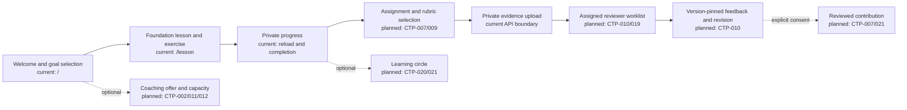

# PLAN-001: scope reconciliation, story map and decision gates

Owner: Tom Wu. Planning review date: 22 September 2026. Live issue: [#8](https://github.com/deepnative/deep-native-engine/issues/8). This record reconciles the immutable 15 September package with the current cross-audience product direction. It does not authorize deployment, commercial launch, live-provider use or another application slice.

## Source precedence and verified inventory

Use sources in this order:

1. Current explicit owner instructions.
2. [Product direction](PRODUCT-DIRECTION.md) and the revised live GitHub issues.
3. Applicable final files in `context/source-2026-09-15/outputs/contractor-platform/`.
4. Older files under the preserved `work/` directory.

The repository contains all 25 manifest-listed source files. `make verify` recalculates every byte count and SHA-256 hash against [`source-manifest.json`](context/source-manifest.json); these files are evidence and must remain unchanged. The copied personal runtime symlink and `.DS_Store` metadata were never part of that 25-file inventory. Current planning and implementation live outside the archive.

| Area | Confirmed reusable asset | Current decision |
| --- | --- | --- |
| Product scope | Final business/build package, 25 CTP specifications, financial model and evidence register | Preserve provenance and still-applicable privacy, consent, date, ledger and truthful-readiness rules; supersede contractor-only admission and universal coaching assumptions |
| Audience | Nine IT families and contractor journeys | Retain them as optional specializations within an ecosystem for IT practitioners, other professionals, students/career changers, creators/entrepreneurs and curious learners |
| Story and acceptance scope | Nine roadmap journeys, ten build-prompt journeys and eight ecosystem journeys | Preserve all 27 requirement families until QA-002 reviews overlap; do not shrink the denominator because some journeys overlap |
| Prototype | Local server-rendered welcome/goal, lesson, progress, authorization and private-evidence flows | Treat this as a synthetic first-slice prototype, not the full member-to-reviewer journey or a hosted product |
| Architecture | File-first hosted modular-monolith ADR and implemented TypeScript/PostgreSQL slice | Reuse it; authored public curriculum belongs in reviewed versioned files, while private/mutable/transactional state belongs in PostgreSQL |
| Operations | Issue coordination, pre-push gate and Ubuntu CI | Reuse as the delivery workflow; a green technical gate is not launch, customer or provider evidence |
| Commercial model | CAD 3,000 pilot, CAD 9,000 continuation and CAD 12,000 annual Professional package | Preserve as optional coaching hypotheses with their original rules; do not apply them to foundation access or every learner |

No code, private course content or credentials from another repository are approved for reuse. Synthetic fixtures and the current repository's owned planning/application assets are the only present reuse base.

## Explicit supersession map

| Archived assumption | Current rule | Preserved invariant or downstream issue |
| --- | --- | --- |
| Individual IT contractors are the universal member identity | A member may have multiple backgrounds and goals; job, client, contract and coding status are optional | CTP-003 and CTP-008 must keep backgrounds separate from identity, access and staff roles |
| The nine IT families define admission | They are optional technical specialization tags | CTP-003 and CTP-007 retain truthful role/domain readiness |
| Career and contract outcomes define usefulness | Learning, practical application, participation and contribution are core; career services are optional | CTP-009, CTP-015, CTP-018 and CTP-022 |
| The paid Professional offer defines product access | Foundation and participation access need their own decision; Professional remains optional coaching | CTP-002, CTP-011 and CTP-017 |
| Fit review can block all entry | General learners can start the common foundation; fit/capacity review gates only promises that need specialist service | CTP-003, CTP-008 and PLAN-003 |
| Portfolio sharing is the main community action | Add bounded learning circles and reviewed contributions without disclosing private work | CTP-020, CTP-021 and QA-004 |
| Nine roadmap journeys are the complete release scope | Retain those nine, all ten build-prompt journeys and ECO-01 through ECO-08 | QA-002 owns the versioned full-release mapping and overlap review |

Contractor and paid-service flows remain supported where selected. Supersession changes who may learn and participate; it does not erase applicable consent, privacy, offer-version, payment-date, entitlement or audit obligations.

## Cross-audience story map

The three operating perspectives stay separate. Backgrounds and goals never grant staff privileges.

| Activity | Member | Coach/reviewer | Operator/editor | Delivery stage |
| --- | --- | --- | --- | --- |
| Orient | See actual ecosystem scope, readiness and access terms; choose overlapping backgrounds, interests and goals | See only assigned service scope | Maintain truthful availability and content status | B1 |
| Learn | Use the common six-lesson foundation and a goal-appropriate exercise; save private progress | Support an assigned learner when a valid grant exists | Publish eligible, sourced and reviewed content versions | B1 |
| Apply | Create private evidence against a pinned assignment and rubric | Review only the authorized submission/version with criterion-level evidence | Reconcile workflow failures without acquiring ordinary private access | B1 |
| Revise and demonstrate | Submit a new version; retain earlier work and labelled simulated status | Publish bounded feedback; preserve prior review | Audit review state and exceptions | B1 |
| Participate | Opt into a learning circle, ask questions, report problems and leave | Facilitate a specifically assigned circle or clinic | Enforce rules, moderation ownership and revocation | B2 |
| Contribute | Propose a resource with attribution, rights and explicit destination consent | Review only within qualified scope | Approve/reject/retire publication separately from private review | B2 |
| Use optional services | See actual coverage/capacity and explicitly accept a versioned offer | Deliver only reserved, qualified capacity | Reconcile entitlements, bookings, invoices and exceptions | B2/C |
| Control data | Export, revoke sharing and request deletion | Lose access immediately when grants revoke | Complete deletion/retention workflow with auditable exceptions | B2/B3 |

### First vertical slice versus full Phase B

The first member-to-reviewer slice is: member chooses a goal → opens eligible foundation content → completes an assignment using synthetic data → submits private evidence with explicit consent → an assigned qualified reviewer publishes version-pinned feedback → member revises and sees preserved history.

Current `main` proves only bounded parts of that sequence: goal selection, one suitable exercise for each broad audience, saved progress, server-derived workspaces, expiring staff grants, private evidence, quarantine, short-lived authorized downloads and deletion. Content publication, rich onboarding/plans, assignment selection and published human feedback remain open under CTP-003, CTP-007 through CTP-010.

Full Phase B additionally requires the remaining 27 requirement families: bounded participation/contributions, entitlements and booking, maintained workflow downloads, AI consent/budgets/jobs and study help, test/manual billing and continuation, goals/projects, clinics, staff operations, privacy requests, metrics and the complete browser rehearsal. Finishing B1 does not complete B2 or B3.

## Low-fidelity private prototype map

This map describes observable pages and transitions. Each node states whether its page or boundary is current or planned; optional transitions use dashed arrows. Planned nodes may not be presented as working.



Prototype rules:

- Empty or planned states say they are unavailable; there are no inert controls or invented coaches, customers or outcomes.
- A general learner can complete the foundation without a job title, coding experience, IT-fit approval or coaching purchase.
- Non-IT professional and IT paths use goal-appropriate examples; neither audience is treated as a privilege role.
- Member evidence remains private unless a distinct review, circle or publication scope is explicit.
- Demo/test/manual/configured/live-verified states remain visible and separate.

Review the current synthetic member prototype by following [the local verification and preview instructions](workflows/VERIFICATION.md). The reviewer and operator sketches below are planning artifacts; their controls do not exist yet.

```text
Assigned reviewer worklist — planned
┌────────────────────────────────────────────────────────────┐
│ Assignment: Foundation exercise v3   Rubric: Foundation v2 │
│ Member: assigned pseudonymous ID     Grant: active to date │
│ Evidence: quarantined / clean / unavailable                │
│ [Open authorized version] [Record criterion feedback]      │
│ [Publish review] requires qualification + active grant     │
└────────────────────────────────────────────────────────────┘

Operator/editor state — planned
┌────────────────────────────────────────────────────────────┐
│ Queue: failed workflow / privacy request / content release │
│ State: demo | test | manual | configured | live-verified   │
│ Owner and due gate: named       Private access: none       │
│ [Retry bounded job] [Reconcile] [Publish eligible version] │
│ Every action records actor, reason, version and timestamp  │
└────────────────────────────────────────────────────────────┘
```

The worklist exposes only an assigned, unexpired purpose and authorized evidence version. Operator reconciliation never grants ordinary access to private evidence, and content publication remains separate from member-review decisions.

## Acceptance journey reconciliation

The nine roadmap journeys cover: reviewed evidence; privacy/revocation; last-slot/last-unit concurrency; pilot/continuation/renewal/payment interruption; AI consent/grounding/quota/cost; content/template updates; ongoing service; all-role admission/truthful expertise; and operator reconciliation/privacy lifecycle.

The ten build-prompt journeys retain the same high-risk flows while adding or making explicit: payment disorder, retired/unverified content and template behavior, commercial-truth checks, and narrow/mobile, keyboard, validation, empty/error/loading and reload-recovery behavior. BUILD-04 also preserves the late-continuation rule: only timely acceptance starts the CAD 9,000 ten-month continuation at month three and keeps the original anniversary; a late return requires a separately priced, explicitly accepted agreement with stated dates and credit treatment, with no retroactive charges or allowances. These are retained even where another journey overlaps. See the [versioned scenario register](../../tests/e2e/scenarios.json) and the [archived build-prompt source](context/source-2026-09-15/outputs/contractor-platform/02-codex-build-prompt.md).

ECO-01 through ECO-08 add: general-learner entry; equivalent IT/non-IT paths; changed interests and return after a gap; learning-circle participation; reviewed member contributions; study help outside career practice; optional coaching without identity/tier confusion; and separate learning/participation/service metrics.

QA-002 must later publish the canonical scenario decomposition. Until then the denominator is 27 requirement families, no family is marked complete by overlap, and slice registers report their narrower numerator separately.

## Open decision register

“Due” names the gate before which the decision is required; no unsupported calendar deadline is invented. Tom Wu is accountable for obtaining any specialist advice and recording the final decision.

| Decision | Accountable owner | Current evidence/status | Decision due | Downstream blocker |
| --- | --- | --- | --- | --- |
| Contracting entity and seller identity | Tom Wu, with legal/accounting advice | Unknown; archived package is a proposal | Before signing terms, opening live payment/provider accounts or issuing real invoices | PLAN-002, CTP-016, production launch |
| Operating province and enabled countries | Tom Wu, with jurisdiction-specific legal/tax advice | Canada-oriented assumption only; no province/country allowlist approved | Before hosted real-member access, final privacy/terms/tax classification or country marketing | PLAN-002, CTP-025 |
| Cash budget | Tom Wu | Financial workbook is assumptions-based and does not confirm available capital | Before paid providers, hiring, expert commitments or any paid cohort/service promise | PLAN-003, provider selection, pilot operations |
| Founder availability | Tom Wu | No committed hours, operating calendar or backup owner is evidenced | Before assigning delivery ownership or promising cohort, review or service dates | PLAN-003, GOV-001, pilot operations |
| Foundation and participation access/pricing | Tom Wu | No free tier, membership price or subsidy is approved; archived prices apply only to optional coaching hypotheses | Before public access promises, paywall/entitlement design or marketing | CTP-002, CTP-008, CTP-011 |
| Data, AI, identity, storage, email/calendar and payment providers | Tom Wu with engineering/privacy review | Deterministic adapters only; live providers disabled | Before transmitting real data, enabling live effects or claiming provider readiness | CTP-004, CTP-014, CTP-016, CTP-025 |
| Content ownership, source rights and review standard | Tom Wu as interim content owner; named qualified reviewers by domain | Synthetic first-slice examples only; broader assets and qualified sign-off remain unaudited | Before publishing non-synthetic/specialist content or calling it expert-reviewed | PLAN-004, CTP-007, CTP-010 |
| Expert roster, qualifications, service types, capacity, cost and backup | Tom Wu with a named service lead | No contracted roster or qualified live capacity is evidenced | Before offering tailored assessment, coaching, clinics or guaranteed coverage | PLAN-003, CTP-003, CTP-012, CTP-019/020 |
| Member terms, privacy/retention, refunds, renewals and incident process | Tom Wu with jurisdiction-specific review | Draft requirements only; technical local controls are not legal/operational approval | Before public registration, real uploads, paid agreements, renewals or production retention | PLAN-002, CTP-017, CTP-021, CTP-025 |

Each resolution must record date, decision maker, reviewed evidence, affected versions, limitations and follow-up owner. Unknowns stay visible; local synthetic work may continue only when it does not make the blocked promise or process real data.

## Planning acceptance and next dependency

PLAN-001 is complete when this record is reviewed, source verification passes, issue acceptance is checked against links/evidence, and the resulting `main` commit passes repository CI. Completion resolves the scope/story/decision dependency only. It does not resolve the decisions in the register or close a phase gate.

The next dependency-ready issue is [GOV-001 #11](https://github.com/deepnative/deep-native-engine/issues/11). After GOV-001 is evidenced, [CTP-001 #15](https://github.com/deepnative/deep-native-engine/issues/15) can close the architecture audit; that enables [CTP-003 #20](https://github.com/deepnative/deep-native-engine/issues/20), which is required before content lifecycle issue [CTP-007 #26](https://github.com/deepnative/deep-native-engine/issues/26).
