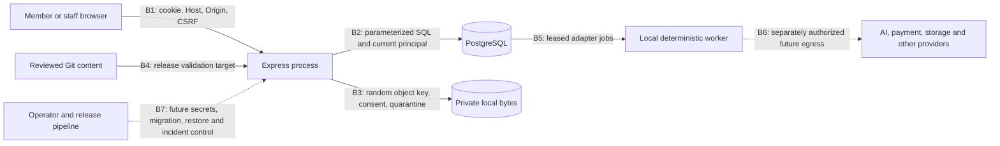

# QA-004: threat model and security decision record

- **Issue:** [QA-004 #18](https://github.com/deepnative/deep-native-engine/issues/18)
- **Accountable owner:** Tom Wu; technical control owner for each future capability is the lead of its linked issue until a named operator accepts it.
- **Reviewed system snapshot:** local `main` at `622aae2a8a2b8280ce2eb42e14feef63fd42f5bb`, 23 September 2026. This is a planning record; its review and merge evidence belong in the live issue.
- **Scope:** the current local synthetic application plus explicit design risks for the private MVP and a possible hosted launch. It changes no application code, configuration, provider or production setting.

## What exists and what is still a proposal

The current process is a loopback TypeScript/Express application with PostgreSQL and private local filesystem bytes. It has an opaque cookie credential, server-derived member/staff identity, workspace and cohort access checks, consented evidence, simulated quarantine, short-lived download capabilities, deterministic adapters and durable jobs. The [architecture audit](CTP-001-ARCHITECTURE-AUDIT.md), [authorization record](CTP-005-WORKSPACE-AUTHORIZATION.md), [evidence record](CTP-006-PRIVATE-EVIDENCE.md), [adapter record](CTP-004-DETERMINISTIC-ADAPTERS.md), [HTTP routes](../../src/app.ts), [schema](../../migrations/) and [scenario register](../../tests/e2e/scenarios.json) are the inspected sources. Existing checks cover a **local slice**, not the 27 outstanding full-MVP journeys or a hosted system.

There is no production identity provider, live malware scanner, AI retrieval, payment/entitlement ledger, booking, public contribution publication, general discussion, operator reporting/export, hosted secret store or production backup/restore. The adapter can report live settings as *configured* but performs no live provider operation; `src/config.ts` rejects live application startup. Threats against those capabilities below are design requirements for their owners, not observed vulnerabilities or passed tests. The [product direction](PRODUCT-DIRECTION.md) makes learning and bounded participation available to IT practitioners, other professionals and general learners; a background, goal, cohort membership or the historical Professional offer name never grants staff privilege or a paid entitlement.

## Assets, actors and trust boundaries

| Asset or data class | Authorized use | Boundary that must hold |
| --- | --- | --- |
| Public authored lessons, rubrics and workflow examples | Reviewed versioned publication | Git-reviewed content may be displayed; it must not execute, choose a member identity or grant private access. Future member contributions need separate rights and editorial approval. |
| Member identity, goals, drafts, progress and review metadata | The member and exact-purpose authorized staff | PostgreSQL resolves the principal from the credential on every request; client IDs, background and selected offer are only data. |
| Raw evidence, derivatives, extracted text and possible embeddings | Owner or expressly authorized destination | Bytes remain in private object storage; metadata, consent, quarantine and current authorization determine every read. A retrieval index is a separate private-data copy, not a public catalog. |
| Cohort content, participation and reports | Exact opted-in cohort or permitted moderator/analyst view | Joining or leaving a cohort changes only its bounded sharing permission. Private work, staff role and outreach consent do not follow membership. |
| Optional coaching money, time, bookings and payment events | Explicitly purchased service and authorized service staff | Integer money/minutes, immutable history, idempotent events and atomic reservations stay separate from foundation learning access. None exists yet. |
| Secrets, capability keys, job control and audit/backup records | Named operators and approved runtime only | Never enter repository content, prompts, fixtures, browser responses or generic logs; access and rotation must be explicit before hosting. |

| Boundary | Current control and evidence | Residual risk or required future control |
| --- | --- | --- |
| B1 browser to HTTP | [App](../../src/app.ts) enforces configured Host, Origin/CSRF for writes, request limits, CSP, no-store responses and an HttpOnly SameSite cookie. [L07 and L10](../../tests/e2e/scenarios.json) exercise local request failures; [app unit tests](../../tests/unit/app.test.ts) exercise Host validation. | Cookie and session are a loopback preview, without verified login, recovery, production TLS/cookie configuration or external-origin deployment review. |
| B2 application to PostgreSQL | [Authorization](../../src/authorization.ts) re-resolves principal/grant/membership; composite keys restrict cross-workspace joins; support reads audit in SQL. L15–L17 cover direct access, grants and cohort isolation. | Local process uses a broad database credential. Production DB roles, audit retention, administrator bootstrap and authorization on future exports/commands need separate approval. |
| B3 application to object bytes | [Evidence](../../src/evidence.ts) validates allowlisted 1 MiB types, random keys and consent; `pending` cannot be reviewed; download rechecks access; deletion serializes with new objects. L18–L20 and PostgreSQL contention tests cover the synthetic flow. | A signature check and simulated scanner do not establish malware safety. Managed storage, actual scan service, encryption, backups, legal hold and deletion reconciliation are launch prerequisites. |
| B4 repository/content to runtime | One lesson is compiled in [content](../../src/content.ts); there is no loader or member publication pipeline. | CTP-007 must validate file versions, links, rights and rendered markup. CTP-021 must keep proposals untrusted until explicit review and publication. |
| B5 job row to attempt | [Jobs](../../src/jobs.ts) use a request fingerprint, unique idempotency key, atomic lease, bounded attempts, safe error codes and attempt token. | Provider effects after an ambiguous timeout need provider-specific reconciliation and cost caps. A succeeded job is not proof of a live external effect today. |
| B6 worker to external provider | Deterministic demo/test adapters only; live mode is not started. | Before any egress, define minimum scopes, consent, allowed data, prompt/tool isolation, spend limit, webhook verification and idempotent callback handling per provider. |
| B7 release/operator to runtime/data | The shared gate, locked dependencies and CI verify code and synthetic behavior; no hosted release exists. | Name incident/on-call, secret/backup owners, region, retention, restore objective and production scan policy before real data or deployment. |

## Threat and abuse register

`P0` and `P1` below are **proposed release severity** under the next section, not assertions of a current defect. “Local” means an existing synthetic boundary; “future” means a control must be built and proven in its linked issue. The [test matrix](QA-004-RISK-TEST-MATRIX.md) specifies reproducible negative and race cases by risk ID. Tom Wu owns escalation and unassigned-risk decisions until a named engineering, privacy, product or operations owner accepts them; linked issue leads own implementation and evidence.

| Risk | Abuse or failure and protected invariant | State / control owner and follow-up | Starting severity |
| --- | --- | --- | --- |
| R01 | Forged, expired or replayed session; cross-origin form or hostile Host changes private progress. Principal and CSRF must be server-derived per request. | Local checks; identity/hosting owners in [CTP-005 #24](https://github.com/deepnative/deep-native-engine/issues/24), [CTP-025 #45](https://github.com/deepnative/deep-native-engine/issues/45). | P0 if private data crosses users; otherwise P1 |
| R02 | Guessing IDs or changing a supplied workspace/record ID reads or mutates another member's work. Every resource must bind to current principal/workspace. | Local B2; authorization owner, [CTP-023 #42](https://github.com/deepnative/deep-native-engine/issues/42). | P0 |
| R03 | Background, goal, payment, cohort, editor or moderator status is treated as coach/reviewer/admin authority; grant expiry/revocation is cached. | Local B2 for existing reads; future staff/action owners [CTP-019 #39](https://github.com/deepnative/deep-native-engine/issues/39), [CTP-021 #40](https://github.com/deepnative/deep-native-engine/issues/40). | P0 |
| R04 | Joining, leaving or guessing cohort content exposes private evidence, creates staff rights or is treated as consent to unsolicited outreach; moderator sees more than the reported item. | Local exact read/membership; future participation owner [CTP-020 #37](https://github.com/deepnative/deep-native-engine/issues/37), [CTP-021 #40](https://github.com/deepnative/deep-native-engine/issues/40). | P0 |
| R05 | Oversized, path-like, mismatched or executable upload bypasses quarantine; an unscanned file reaches review or is served inline. | Local B3 validation and pending state; production scanner/storage owner [CTP-006 #25](https://github.com/deepnative/deep-native-engine/issues/25), [CTP-025 #45](https://github.com/deepnative/deep-native-engine/issues/45). | P0 |
| R06 | One evidence consent scope is interpreted as public sharing, private review or another circle; revoked/expired grant or link still downloads. | Local separate scopes and per-download check; publication owner [CTP-021 #40](https://github.com/deepnative/deep-native-engine/issues/40). | P0 |
| R07 | Upload, derivative creation, deletion, connection loss or backup restore leaves accessible orphan bytes, stale index content or unconfirmed success. | Local B3 transaction/reconciliation; derived-data and retention owners [CTP-021 #40](https://github.com/deepnative/deep-native-engine/issues/40), [CTP-025 #45](https://github.com/deepnative/deep-native-engine/issues/45). | P0 for exposed data; P1 for denied/recoverable orphan |
| R08 | Duplicate worker, stale lease or timeout repeats an AI/payment/storage side effect; a result is claimed without confirmation. | Local B5 controls but no live effects; provider owners [CTP-014 #31](https://github.com/deepnative/deep-native-engine/issues/31), [CTP-016 #32](https://github.com/deepnative/deep-native-engine/issues/32). | P0 for charge/secret exposure; P1 otherwise |
| R09 | Untrusted evidence, retrieved text or member content instructs an AI assistant to reveal another member's data, call tools or ignore consent; malformed output is trusted. | Future AI owner [CTP-014 #31](https://github.com/deepnative/deep-native-engine/issues/31), [CTP-015 #34](https://github.com/deepnative/deep-native-engine/issues/34), [CTP-023 #42](https://github.com/deepnative/deep-native-engine/issues/42). | P0 for disclosure/action; P1 for unsafe answer |
| R10 | AI requests exceed token/money allowance or use nonconsented context; retry after an ambiguous result silently bills again. | Future AI/entitlement owners CTP-014, [CTP-011 #27](https://github.com/deepnative/deep-native-engine/issues/27). | P0 for unbounded charge; P1 for bounded incorrect debit |
| R11 | Duplicate/out-of-order/forged payment events or concurrent last-unit reservations double-credit, double-spend or activate service before payment truth is known. | Future ledger/payment owners CTP-011, [CTP-012 #29](https://github.com/deepnative/deep-native-engine/issues/29), CTP-016. | P0 |
| R12 | DST, leap day, Jan-31, renewal anniversary or expiry boundary shifts a booking, allowance, cancellation or refund. | Future offer/booking owners [CTP-002 #19](https://github.com/deepnative/deep-native-engine/issues/19), CTP-012, [CTP-017 #35](https://github.com/deepnative/deep-native-engine/issues/35). | P1; P0 if money/access crosses users |
| R13 | Draft, rejected, revoked or injected learner content appears as reviewed curriculum; rights/attribution or reviewer identity is fabricated. | Future content/contribution owners [CTP-007 #26](https://github.com/deepnative/deep-native-engine/issues/26), [CTP-013 #30](https://github.com/deepnative/deep-native-engine/issues/30), CTP-021. | P1; P0 if private content becomes public |
| R14 | Export, report, small cohort metric or operator query reveals another member's evidence or sensitive attributes; deletion omits copies. | Future reporting/privacy owners CTP-021, [CTP-022 #41](https://github.com/deepnative/deep-native-engine/issues/41), CTP-025. | P0 |
| R15 | Secret, token, raw provider error or private member text leaks through logs, prompt, repository, CI artifact, analytics or backup. | Local redaction/minimization is partial; operations and provider owners CTP-014, CTP-016, CTP-025. | P0 |
| R16 | Dependency, release artifact, migration or operator command changes trust behavior without review; a failed restore is called complete. | Current CI/dependency audit only; release owner [QA-003 #22](https://github.com/deepnative/deep-native-engine/issues/22), CTP-025. | P0 for exploitable release; P1 otherwise |

## Severity, scanning and response policy

| Class | Decision rule | Delivery consequence |
| --- | --- | --- |
| P0 critical | Credible cross-member disclosure; unauthorized privileged action or public publication; active secret compromise; unsafe upload execution; double charge/unbounded spend; loss of required private data without recoverable state. | Stop the affected release or operation immediately. Contain and assign Tom Wu plus the technical owner; do not close the issue or claim the phase gate until reproducible fix, independent review and exact-revision verification exist. |
| P1 high | A viable path to the above without demonstrated impact, failed revocation, inaccurate money/access state, missing audit/deletion copy, or absent required control for an authorized launch. | Block the affected slice or launch. Preserve evidence, record a bounded fix issue, test negative and recovery paths, then re-review before release. |
| P2 moderate | Defense-in-depth or bounded usability failure without a current path to protected data, money or privilege. | Track with owner and due stage; do not silently downgrade a failed critical journey. |

**Current repository gate:** `make verify` runs formatting/lint, types, 99% unit metrics, isolated PostgreSQL integration, desktop/mobile browser journeys, build and `npm audit --omit=dev --audit-level=high`. Review the lockfile diff, sensitive-data output, permission changes and failure handling on every PR. The audit covers production dependencies at its threshold; it is not a full secret scan, SAST, malware scan or proof of a secure hosted runtime. Missing audit data fails the gate. [Quality gates](context/QUALITY-GATES.md) and [verification contract](workflows/VERIFICATION.md) remain authoritative.

**Before a hosted or real-data release:** the CTP-025 owner must approve automated secret detection for source/CI artifacts, an all-dependency vulnerability review with accountable exceptions and expiry, deployment configuration/permissions review, actual upload malware scanning with fail-closed queues, log redaction, backup access and a restore drill. CTP-014/016 owners must approve provider/webhook credentials, rotation, signed callback validation, egress/tool scopes, budgets and provider-specific reconciliation. Record tool/version, findings, disposition and reviewer; do not label a missing control “passed.” No purchase or service enablement is authorized by this policy draft.

**On a suspected incident:** (1) stop the affected feature/release and disable the relevant capability without erasing evidence; (2) assign Tom Wu as interim incident decision owner and the linked technical issue owner as investigator, record time, scope and a redacted timeline; (3) revoke or rotate affected credentials/grants and isolate jobs/objects while preserving necessary forensic records; (4) reproduce with synthetic data and identify all copies, including derivatives, caches, provider state, reports and backups; (5) fix, run the mapped negative/recovery tests and full verification, obtain independent review, and only then restore the affected path; (6) if real data could be involved, obtain the approved privacy/legal owner's decision on notification and retention before any external statement. The local preview has no live on-call, legal notification plan or approved real-data incident SLA. Those assignments block a live launch, not completion of this planning record.

## Open decisions, stop conditions and acceptance

Tom Wu must name a production security/incident lead and a privacy/legal decision owner before hosting or real member data. CTP-025 must settle region, retention/legal hold, secret custody, database least privilege, monitoring, restore objectives and backup deletion. CTP-014/016 must settle provider-specific data transfer, tool scope, callback verification, cost limit and ambiguous-result reconciliation. Content/participation owners must settle publication reviewer authority, rights and moderator/report rules. These are owner decisions, not assumed controls or reasons to stop source-backed planning.

Stop an affected implementation when a required authorization, qualified reviewer, data boundary or promised term is absent. Stop any real-data or paid launch until its open controls have named owners and live evidence. The [risk test matrix](QA-004-RISK-TEST-MATRIX.md) is the requirement handoff for future feature owners and [CTP-023 #42](https://github.com/deepnative/deep-native-engine/issues/42); it does not mark the outstanding full-MVP journeys as passed.

## QA-004 acceptance map

| Live issue criterion | Planning evidence; later implementation obligation |
| --- | --- |
| AC1: workspaces, grants, storage, uploads, retrieval, jobs, payments, secrets and operators | Asset classes, B1–B7 diagram/table and R01–R16 cover each boundary, distinguishing local code from future services. |
| AC2: cross-record, escalation, revoked links, unsafe files, injection, consent, logs and exports | R01–R15 and M01–M20 specify an adversarial action and denied or recovered result. Existing proof is named only for the synthetic subset. |
| AC3: transaction, idempotency, timeout/retry and date invariants with CTP-023 handoff | M07–M08, M12–M16 and M22 require real database contention or controlled clocks, review/ledger atomicity, provider-specific ambiguous-result reconciliation, and release mapping to CTP-023. |
| AC4: scans, owners, response and release-blocking severity | The severity, scanning, response and open-decision sections name Tom Wu as interim escalation owner, issue leads as control owners, P0/P1 blockers, current scan scope and future launch prerequisites. |
| AC5: cohort, moderation, contribution, reporting and removal | R03–R04/R06–R07/R13–R14 and M04/M09–M10/M16–M17/M20 cover explicit sharing, role limits, rights, revocation, export and derived-data cleanup. |

The issue's accepted outcome is a reviewed *planning* artifact and issue-to-test handoff. Later feature owners must implement and prove the proposed controls with their own authorization; this record does not certify them. Independent review, exact-revision repository verification, PR/main CI and final live-issue reconciliation complete the documentation delivery process.
