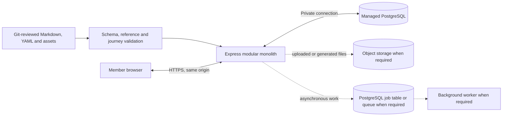

# ADR-0002: File-first content in a dynamic hosted modular monolith

- **Date:** 21 September 2026
- **Owner:** Tom Wu
- **Issue:** [CTP-001 #15](https://github.com/deepnative/deep-native-engine/issues/15)
- **Status:** Accepted for architecture planning; implementation and deployment remain separately authorized

## Problem and constraints

Deep Native Engine must serve dynamic, private learner state. GitHub Pages cannot run the Express process or PostgreSQL transactions required by the current application. At the same time, most curriculum and public product material is authored, reviewable content that does not need database administration or runtime mutation.

The architecture must:

- preserve the tested TypeScript/Express/PostgreSQL modular monolith;
- keep the browser and application on one origin for simple cookie, CSRF and Origin controls;
- minimize database scope without weakening privacy, concurrency, deletion, audit or historical-version guarantees;
- keep content reviewable in Git and accessible to contributors;
- avoid runtime writes to an application instance's filesystem;
- remain portable between hosting providers;
- retain the project's 99% unit, 99% documented-journey and 100% critical-journey/pass gates.

## Decision

Deploy one dynamic TypeScript/Express web service that renders the frontend and owns application behavior. Connect it privately to managed PostgreSQL. Use Git-versioned Markdown, YAML and small static assets as the primary store for authored public content. Add object storage and a background worker only when an authorized feature requires them.

GitHub remains the source, review and CI system. GitHub Pages may host future public documentation or marketing material, but it is not the product runtime. The initial hosting candidate is a Render web service plus Render Postgres in one region; this is a reviewed candidate, not a purchase or deployment decision. Render documents Express web services, custom domains, managed TLS and private database networking. The application and database must remain portable through standard Node.js, PostgreSQL, environment variables and SQL migrations.



## Storage policy

Use this decision rule:

> Human-authored, public, release-versioned material belongs in files. Private, user-generated, mutable, transactional or operational state belongs in PostgreSQL. Large binary objects belong in object storage.

| Data | System of record | Rationale |
| --- | --- | --- |
| Lesson bodies and transcripts | Markdown | Readable diffs, accessible authoring and review |
| Lesson metadata, exercises, rubrics, tracks and prerequisites | YAML | Structured, versioned content with schema validation |
| Background/goal labels and public navigation | YAML | Stable authored catalog; database stores only stable keys |
| Community rules, help and public offer descriptions | Markdown/YAML | Public reviewed copy, not runtime state |
| Small owned images and templates | Repository assets | Versioned with content when license and size permit |
| Sessions, accounts and recovery | PostgreSQL | Private, mutable and security-sensitive |
| Learner preferences and consent | PostgreSQL | Member-specific current and historical state |
| Drafts, submissions, progress and completion | PostgreSQL | Runtime writes, privacy, queries and concurrency |
| Staff grants, review assignments and revocation | PostgreSQL | Authorization and audit invariants |
| Participation, contribution workflow and reports | PostgreSQL | Mutable ownership and moderation state |
| Entitlements, bookings, provider events and ledger entries | PostgreSQL | Transactions, idempotency and reconciliation |
| Audit, retention, export and deletion state | PostgreSQL | Operational evidence and privacy lifecycle |
| Uploaded evidence and generated exports | Object storage plus PostgreSQL metadata | Binary lifecycle with private authorization metadata; require authorized access, quarantine/scanning, revocation and coordinated deletion/restore before use |
| AI, email and export jobs | PostgreSQL job table initially | Keep one transactional boundary until measured load requires a queue |
| Secrets and connection strings | Hosting secret/environment configuration | Never commit secrets to content or source |

The hosted application filesystem is read-only deployment input. Runtime writes must not be used as durable state because instances may restart, redeploy or scale independently.

## Proposed content layout

```text
content/
├── catalog.yaml
├── backgrounds.yaml
├── goals.yaml
├── tracks/
│   └── foundation.yaml
├── lessons/
│   └── clear-instructions/
│       └── v1/
│           ├── metadata.yaml
│           ├── lesson.md
│           ├── exercises.yaml
│           └── rubric.yaml
├── participation/
│   └── community-guidelines.md
└── translations/
    └── zh-CN/
```

Long narrative content uses Markdown. Structured metadata and relationships use YAML. Generated manifests may be JSON, but generated output is not the authoring source.

Every released content item has a stable ID and positive version plus owner, rights/source status, review date, supported goals/backgrounds, prerequisites and lifecycle state. Material content changes create a new immutable version. PostgreSQL records the referenced content ID and version with learner work. An old completion must continue to resolve its original content and rubric after a new version is released. PostgreSQL also resolves opaque credentials to principals and enforces the member-owned workspace, assignment/support grant and cohort boundaries described in [CTP-005](../CTP-005-WORKSPACE-AUTHORIZATION.md); content files never grant private access. The local evidence implementation follows the binary/metadata split, quarantine and deletion boundary in [CTP-006](../CTP-006-PRIVATE-EVIDENCE.md).

The application validates the catalog at build and startup. Validation fails closed for malformed files, duplicate IDs/versions, missing references, unsafe paths, unknown goals/tracks, absent ownership/rights metadata or incomplete accessible content. YAML parsing must reject executable/custom tags and enforce bounded document size, nesting and aliases. Markdown rendering must escape or sanitize raw HTML and reject unsafe URL schemes before content reaches a browser. Browser-supplied IDs and versions are never trusted without server catalog validation.

No secret, private member data, draft, submission, review, booking, entitlement, payment, provider payload or audit record may be stored in repository content files.

## Application and hosting topology

The dynamic product uses one canonical origin such as `app.deepnative.ai`. Express serves HTML, forms and static assets and may add versioned JSON endpoints later within the same process. A separate frontend/API deployment is deferred until a real client, scaling or ownership requirement justifies the extra CORS, authentication and operational boundary.

The initial hosting candidate is:

- one Node 24 Express web service;
- one managed PostgreSQL database in the same region over its internal/private URL;
- a custom application domain with managed TLS;
- environment-managed database URL, canonical origin and stable session/CSRF secrets;
- a controlled migration step before application rollout;
- a readiness endpoint that checks application startup without exposing data;
- backups and a tested restoration procedure before retaining real member data.

Render requires a public web service to bind to `0.0.0.0` and recommends using its `PORT` value. Render also provides internal PostgreSQL URLs for private traffic when the service and database share a workspace and region, and point-in-time recovery on eligible paid PostgreSQL services. Workspace, region, plan, budget, retention and recovery objectives remain owner decisions before deployment.

## Current-to-target changes

The current local slice remains valid evidence for local behavior. A separately authorized implementation must:

1. Move authored lesson/goal/example definitions from `src/content.ts` into validated versioned content files without changing current observable journeys.
2. Add a typed content loader and generated/validated manifest; include every executable loader path in unit coverage.
3. Preserve PostgreSQL learner/session/progress data and stable lesson/version references.
4. Separate local-only and hosted configuration. Hosted mode accepts an approved managed PostgreSQL host, binds to the provider port/address, uses a stable secret and enforces the canonical HTTPS origin. Local/test mode remains loopback-only.
5. Set Secure cookie/proxy behavior from explicit hosted configuration and keep HttpOnly, SameSite and CSRF/Origin defenses.
6. Move schema migration from opportunistic multi-instance startup to a controlled release operation with forward and recovery instructions.
7. Add health/readiness, structured redacted logs, request limits, retention cleanup, backup/restore evidence and monitored failure alerts.
8. Keep provider-specific deployment configuration at the infrastructure edge; domain modules do not import a Render SDK.

## Failure and recovery expectations

- A malformed or incomplete content release fails CI and deployment; the last healthy application remains active.
- Missing content referenced by persisted progress fails visibly and blocks release rather than silently substituting a newer version.
- Database unavailability produces an honest bounded error and does not claim an unconfirmed save; persisted data remains authoritative after recovery.
- A deployment rollback never rewrites or drops member data automatically. Schema changes require compatible rollout and explicit recovery instructions.
- Loss of an application instance loses no durable data because runtime state is in PostgreSQL or object storage.
- Backup availability is not accepted as recovery evidence until a restore is exercised in an isolated environment.

## Acceptance tests for an implementation slice

- Given the current three learner goals, validated file content renders the same suitable lesson/exercise outcomes for general, non-IT professional and IT learners.
- Invalid or oversized YAML, excessive aliases/nesting, custom tags, duplicate IDs, missing references, path traversal and missing required metadata each fail the shared gate.
- Raw HTML, scriptable markup and unsafe Markdown URL schemes are escaped, sanitized or rejected, with focused regression cases.
- Publishing version 2 leaves a version-1 completion and rubric resolvable and unchanged.
- Browser-supplied unknown or ineligible content IDs cannot read, write or complete progress.
- No repository file changes when members save, complete, delete or concurrently update work.
- Independent member sessions remain isolated; deletion removes the configured dynamic state without deleting shared content.
- Local and hosted configuration tests reject unsafe database/origin/cookie combinations and never print credentials.
- Migration, database interruption, rollback and restore scenarios have observable evidence.
- The existing learning journeys and the deterministic-adapter readiness journey remain in the register and pass on the complete supported browser matrix; the 27 full-MVP requirements remain visible until implemented.
- Unit statements, branches, functions and lines remain at least 99% globally and per executable module, including the new loader and unimported source.

## Alternatives considered

### Store all content in PostgreSQL

Rejected for the current stage. It adds editorial UI, migrations and database coupling for material that benefits from Git review, readable diffs and immutable releases. Dynamic publication may later store workflow metadata in PostgreSQL while versioned source content remains file-backed.

### Store learner progress in YAML/JSON files

Rejected. Runtime files do not provide safe multi-instance durability, row authorization, transactions, concurrent updates, reliable deletion evidence or operational querying. Committing member data would expose private information and require dangerous repository credentials.

### GitHub Pages frontend plus a separate API

Deferred. It can serve dynamic data through an external API, but it forces a frontend rewrite and adds cross-origin authentication/CORS complexity without a current product requirement. GitHub Pages remains suitable for public documentation or marketing only.

### Browser-only local storage

Rejected as the product data model. It is acceptable only for a clearly labelled disposable demo because it has no recovery, cross-device access, staff review, audit or server-side privacy lifecycle.

### Microservices or provider-native database APIs

Deferred. The current team and slice benefit from one deployable transaction boundary. Split only when measured scale, security isolation, deployment cadence or ownership demonstrates a need.

## Consequences, cost and reversibility

This decision reduces database scope and keeps curriculum changes reviewable, but content releases require Git/CI rather than an immediate runtime CMS. Nontechnical editorial workflows may later create pull requests or add database-backed publication metadata. File schemas become public contracts and require careful versioning.

The topology is reversible: standard Node.js, PostgreSQL, Markdown/YAML and environment variables allow a move from Render to another container/web-service host. The custom domain provides the stable public address. Provider plans, data region, backup window and estimated operating cost must be reviewed before purchase; no free-plan durability is assumed.

## Open owner decisions and stop conditions

The following block hosted implementation or real member data, but do not block this architecture record:

- hosting provider and paid budget approval;
- deployment region and applicable privacy jurisdiction;
- canonical domain and DNS control;
- production identity verification, account recovery and staff bootstrap;
- retention periods and expired-session purge policy;
- recovery point and recovery time objectives plus backup export ownership;
- monitoring/on-call owner and incident response path;
- content owners, rights evidence and publication reviewers;
- foundation access/pricing decisions, which remain separate from optional coaching.

Stop before provisioning, deploying, entering credentials or accepting real member data until the applicable owner decisions, privacy operations and a deployment-specific issue are authorized. This ADR does not establish production, security, legal, demand or commercial readiness.

## Official references reviewed

- [GitHub Pages overview](https://docs.github.com/en/pages/getting-started-with-github-pages/what-is-github-pages): Pages hosts static files.
- [Render web services](https://render.com/docs/web-services): Express support, port binding, TLS, domains and rollback capabilities.
- [Render private network](https://render.com/docs/private-network): same-region internal service and PostgreSQL connectivity.
- [Render PostgreSQL backup and recovery](https://render.com/docs/postgresql-backups): plan-dependent point-in-time recovery and logical exports.
- [YAML 1.2 specification](https://yaml.org/spec/1.2.2/): authoring format baseline.

## Review and supersession

CTP-001 recommends GPT-6 Astra/high for architecture and an independent GPT-6 Astra/high review. A future decision may supersede the hosting provider or introduce a separate frontend/API, content service or queue when evidence supports it. Any superseding ADR must preserve content version references, privacy boundaries, observable migration/rollback evidence and the existing journey denominator.
